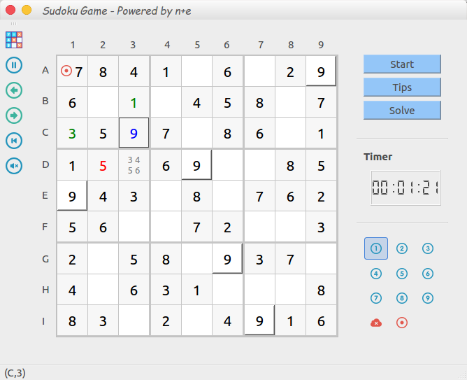

# sudoku-qt5

Sudoku game with qt5

For more detail, please see sudoku/sudoku.pdf

Ubuntu:

```
sudo apt install qt5-default qt5-qmake qtcreator qtmultimedia5-dev
cd sudoku
qmake -makefile
make -j4 
./sudoku &
```
Windows/Mac:

Use qtcreator ...qwq


